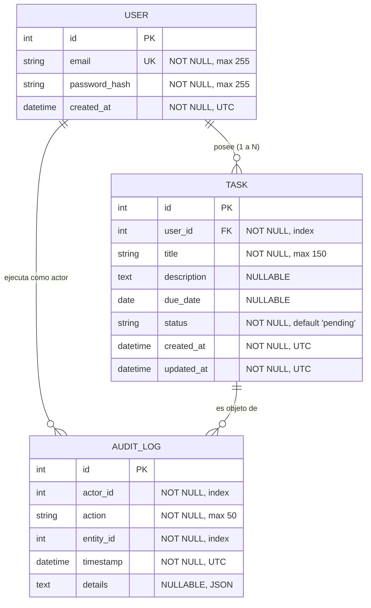
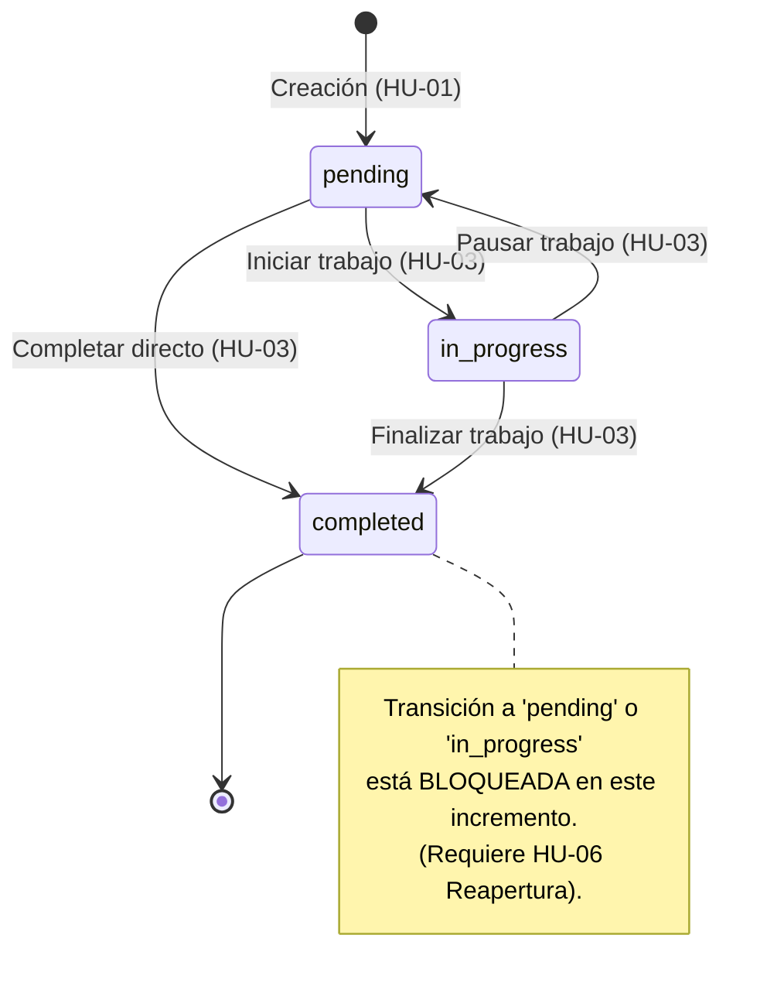

# Data Model: 001-basic-tasks-auth

**Feature**: 001-basic-tasks-auth  
**Date**: 2026-09-29  
**ORM**: SQLAlchemy  

---

## 1. Diagrama Entidad-Relación

---

## 2. Entidades y Esquemas Detallados

### 2.1. Entidad `User`
Representa al usuario registrado y autenticado en el sistema.

| Campo | Tipo | Restricciones | Descripción |
|---|---|---|---|
| `id` | `Integer` | PK, autoincrement | Identificador único del usuario |
| `email` | `String(255)` | Unique, Not Null, Index | Correo electrónico normalizado (lowercase) |
| `password_hash` | `String(255)` | Not Null | Hash criptográfico de la contraseña (scrypt/pbkdf2) |
| `created_at` | `DateTime` | Not Null, Default UTC | Fecha y hora de creación de la cuenta |

**Reglas de validación a nivel de dominio (`UserService`)**:
- Formato de email válido según RFC 5322 (regex básica: `^[a-zA-Z0-9_.+-]+@[a-zA-Z0-9-]+\.[a-zA-Z0-9-.]+$`).
- Longitud de contraseña en texto plano en el registro: mínimo 8 caracteres.
- Unicidad estricta de correo: verificación previa en servicio y restricción `UNIQUE` en base de datos.

---

### 2.2. Entidad `Task`
Representa una tarea registrada por un usuario.

| Campo | Tipo | Restricciones | Descripción |
|---|---|---|---|
| `id` | `Integer` | PK, autoincrement | Identificador único de la tarea |
| `user_id` | `Integer` | FK (`users.id`), Not Null, Index | Propietario de la tarea |
| `title` | `String(150)` | Not Null | Título de la tarea (obligatorio, no vacío) |
| `description` | `Text` | Nullable | Detalle extendido de la tarea |
| `due_date` | `Date` | Nullable | Fecha límite asignada |
| `status` | `String(20)` | Not Null, Default `'pending'` | Estado actual del ciclo de vida |
| `created_at` | `DateTime` | Not Null, Default UTC | Fecha de creación de la tarea |
| `updated_at` | `DateTime` | Not Null, Default UTC, onupdate UTC | Fecha de última actualización |

**Estados permitidos**:
- `pending`: Tarea creada pendiente de inicio (estado por defecto).
- `in_progress`: Tarea en proceso de trabajo.
- `completed`: Tarea finalizada.

---

### 2.3. Máquina de Estados de `Task` para el Incremento 1

**Reglas de validación a nivel de dominio (`TaskService`)**:
- `title` no puede ser nulo, ni estar vacío, ni contener exclusivamente espacios en blanco (`title.strip() != ""`). Longitud máxima: 150 caracteres.
- `due_date` debe ser una fecha válida si se proporciona.
- Transiciones de estado permitidas:
  - `pending` → `in_progress` (Válida)
  - `pending` → `completed` (Válida)
  - `in_progress` → `completed` (Válida)
  - `in_progress` → `pending` (Válida)
  - `completed` → `*` (Inválida en este incremento - emite `InvalidStateTransitionError`).
- Aislamiento de usuario: Toda consulta, edición o cambio de estado verifica que `task.user_id == current_user.id`.

---

### 2.4. Entidad `AuditLog`
Registro inmutable para observabilidad y auditoría de cambios de estado (Principio VIII).

| Campo | Tipo | Restricciones | Descripción |
|---|---|---|---|
| `id` | `Integer` | PK, autoincrement | Identificador único del evento de auditoría |
| `actor_id` | `Integer` | Not Null, Index | ID del usuario autenticado que ejecutó la acción |
| `action` | `String(50)` | Not Null | Código de acción (`TASK_CREATED`, `STATUS_CHANGED`, `TASK_UPDATED`) |
| `entity_id` | `Integer` | Not Null, Index | ID de la entidad afectada (`Task.id`) |
| `timestamp` | `DateTime` | Not Null, Default UTC | Marca de tiempo exacta en UTC |
| `details` | `Text` | Nullable | Payload JSON con información contextual |

**Constantes de Acciones**:
- `TASK_CREATED`: Registro inicial de la tarea.
- `STATUS_CHANGED`: Cambio de estado (detalla `old_status` y `new_status`).
- `TASK_UPDATED`: Edición de título, descripción o fecha límite.
