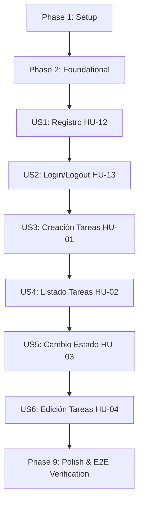

# Tasks: 001-basic-tasks-auth

**Feature**: 001-basic-tasks-auth (Gestión básica de tareas con autenticación)  
**Spec**: [spec.md](file:///C:/Users/osqui/OneDrive/Desktop/Nuevo_Proyecto/specs/001-basic-tasks-auth/spec.md) | **Plan**: [plan.md](file:///C:/Users/osqui/OneDrive/Desktop/Nuevo_Proyecto/specs/001-basic-tasks-auth/plan.md)  
**Date**: 2026-09-29  
**Status**: Completed  

---

## Phase 1: Setup (Shared Infrastructure)

**Purpose**: Inicialización del proyecto monolítico en 4 capas, dependencias y configuración base.

- [X] T001 Create project directory structure for monolito 4-capas (`src/taskcontrol/{models,services,routes,templates,static}` and `tests/{unit,services,functional}`) per `specs/001-basic-tasks-auth/plan.md`
- [X] T002 Initialize Python project configuration and dependencies in `requirements.txt` (`Flask>=3.0`, `Flask-SQLAlchemy>=3.1`, `Flask-Migrate>=4.0`, `pytest>=8.0`, `pytest-flask>=1.3`, `python-dotenv>=1.0`)
- [X] T003 [P] Create application configuration module in `src/taskcontrol/config.py` loading `SECRET_KEY`, `DATABASE_URL` and `FLASK_ENV` from environment variables
- [X] T004 [P] Create single-command launch script `run.ps1` and environment template `.env.example`

---

## Phase 2: Foundational (Blocking Prerequisites)

**Purpose**: Infraestructura bloqueante del monolito (base de datos, fábrica de aplicación, sesiones seguras, auditoría estructurada y plantillas base).

**CRITICAL**: Ninguna historia de usuario puede implementarse hasta completar esta fase.

- [X] T005 Initialize extensions and application factory `create_app()` in `src/taskcontrol/extensions.py` and `src/taskcontrol/__init__.py` with SQLAlchemy and Flask-Migrate
- [X] T006 [P] Create database base configuration and test fixtures in `tests/conftest.py` with in-memory SQLite database and test client
- [X] T007 [P] Create `AuditLog` model in `src/taskcontrol/models/audit.py` with constraints `id (PK, Integer)`, `actor_id (Integer, Not Null, Index)`, `action (String(50), Not Null)`, `entity_id (Integer, Not Null, Index)`, `timestamp (DateTime UTC, Not Null)` and `details (Text, Nullable)` per `data-model.md`
- [X] T008 Implement centralized structured audit logging service in `src/taskcontrol/services/audit_service.py` recording `actor_id`, `action`, `entity_id`, `timestamp` in database and emitting JSON log to stdout per Principle VIII
- [X] T009 [P] Implement authentication decorator `@login_required` in `src/taskcontrol/routes/auth_helpers.py` verifying active session in backend before accessing protected routes per Principle VII
- [X] T010 Create base Jinja2 template with layout, navbar, flash messages block and CSS in `src/taskcontrol/templates/base.html` and `src/taskcontrol/static/css/styles.css`
- [X] T011 Initialize Flask-Migrate repository in `migrations/` and configure database migrations per Principle VI

**Checkpoint**: Base del monolito lista. La implementación de historias de usuario puede comenzar.

---

## Phase 3: User Story 1 - Registro de Usuario (HU-12) (Priority: P1) 🎯 MVP Core

**Goal**: Permitir el registro de un nuevo usuario con correo único y contraseña cifrada (hash).

**Independent Test**: Registrar un usuario nuevo mediante formulario o `POST /auth/register`; verificar que el usuario quede persistido con su contraseña hasheada y que no se permita registrar el mismo correo dos veces.

### Tests for User Story 1 (Test-First bloqueante - Principio IV) ⚠️
> **NOTA: Escribir estas pruebas primero y verificar que FALLAN antes de implementar el código**

- [X] T012 [P] [US1] Write failing unit and service tests for user registration and validation in `tests/services/test_user_service.py` (email format validation, email uniqueness, password hashing with scrypt/pbkdf2, password min 8 characters)
- [X] T013 [P] [US1] Write failing functional tests for `POST /auth/register` in `tests/functional/test_auth_routes.py` (201/302 on success, 400 on invalid input, 409 on duplicate email per contract)

### Implementation for User Story 1
- [X] T014 [P] [US1] Create `User` model in `src/taskcontrol/models/user.py` with constraints `id (PK, Integer)`, `email (String(255), Unique, Not Null, Index)`, `password_hash (String(255), Not Null)`, `created_at (DateTime UTC, Not Null)`
- [X] T015 [US1] Implement `register_user` in `src/taskcontrol/services/user_service.py` with Werkzeug password hashing and duplicate check (make `test_user_service.py` pass)
- [X] T016 [US1] Implement registration route in `src/taskcontrol/routes/auth.py` and template `src/taskcontrol/templates/auth/register.html` adhering to `specs/001-basic-tasks-auth/contracts/auth-contracts.md` (make functional tests pass)

**Checkpoint**: User Story 1 completamente funcional y verificada de forma independiente.

---

## Phase 4: User Story 2 - Inicio y Cierre de Sesión (HU-13) (Priority: P1)

**Goal**: Permitir a usuarios registrados iniciar sesión mediante cookies seguras firmadas en backend y cerrar sesión invalidándola.

**Independent Test**: Iniciar sesión con credenciales válidas para obtener cookie de sesión; verificar acceso a rutas protegidas; cerrar sesión y verificar que el acceso posterior es bloqueado con código 401 / redirección.

### Tests for User Story 2 (Test-First bloqueante - Principio IV) ⚠️
- [X] T017 [P] [US2] Write failing service tests for authentication in `tests/services/test_user_service.py` (verify correct password returns user, invalid password returns None, unknown email returns None)
- [X] T018 [P] [US2] Write failing functional tests for login/logout in `tests/functional/test_auth_routes.py` (`POST /auth/login` sets signed session cookie, invalid credentials return 401, `POST /auth/logout` clears session)

### Implementation for User Story 2
- [X] T019 [US2] Implement `authenticate_user` in `src/taskcontrol/services/user_service.py` verifying hashed password with `check_password_hash`
- [X] T020 [US2] Implement login and logout endpoints in `src/taskcontrol/routes/auth.py` and template `src/taskcontrol/templates/auth/login.html` per `specs/001-basic-tasks-auth/contracts/auth-contracts.md`
- [X] T021 [US2] Implement root blueprint in `src/taskcontrol/routes/main.py` redirecting authenticated users to `/tasks` and unauthenticated users to `/auth/login`

**Checkpoint**: Autenticación completa (HU-12 y HU-13 operativas de punta a punta).

---

## Phase 5: User Story 3 - Creación de Tareas (HU-01) (Priority: P2)

**Goal**: Permitir a un usuario autenticado registrar una nueva tarea con título obligatorio, descripción y fecha límite opcionales, estado inicial "pendiente" y generación de log de auditoría.

**Independent Test**: Crear una tarea con sesión activa; verificar en base de datos que `status="pending"`, `user_id` corresponde al actor actual y que existe un registro en `AuditLog` con acción `TASK_CREATED`.

### Tests for User Story 3 (Test-First bloqueante - Principio IV) ⚠️
- [X] T022 [P] [US3] Write failing service tests for task creation in `tests/services/test_task_service.py` (mandatory title not empty, title max 150 chars, default status 'pending', user association, audit log generation with action `TASK_CREATED`)
- [X] T023 [P] [US3] Write failing functional tests for `POST /tasks` in `tests/functional/test_task_routes.py` (201/302 on success, 400 on empty title, 401 without session)

### Implementation for User Story 3
- [X] T024 [P] [US3] Create `Task` model in `src/taskcontrol/models/task.py` with constraints `id (PK, Integer)`, `user_id (FK users.id, Not Null, Index)`, `title (String(150), Not Null)`, `description (Text, Nullable)`, `due_date (Date, Nullable)`, `status (String(20), Not Null, default 'pending')`, `created_at (DateTime UTC, Not Null)`, `updated_at (DateTime UTC, Not Null)`
- [X] T025 [US3] Implement `create_task` in `src/taskcontrol/services/task_service.py` enforcing `title.strip() != ""` and invoking `audit_service.log_event` with action `TASK_CREATED`
- [X] T026 [US3] Implement task creation route handler in `src/taskcontrol/routes/tasks.py` and creation form/modal in `src/taskcontrol/templates/tasks/index.html` per `specs/001-basic-tasks-auth/contracts/task-contracts.md`

**Checkpoint**: Creación de tareas funcional con trazabilidad de auditoría.

---

## Phase 6: User Story 4 - Listado y Filtrado de Tareas (HU-02) (Priority: P2)

**Goal**: Permitir al usuario visualizar el listado de sus propias tareas con filtros por estado (`pending`, `in_progress`, `completed`), garantizando aislamiento total frente a otros usuarios.

**Independent Test**: Crear tareas para Usuario A y Usuario B; al iniciar sesión como Usuario A solo se deben listar las tareas de A; aplicar filtros y verificar que solo aparezcan tareas del estado seleccionado.

### Tests for User Story 4 (Test-First bloqueante - Principio IV) ⚠️
- [X] T027 [P] [US4] Write failing service tests for task query and isolation in `tests/services/test_task_service.py` (returns only tasks belonging to authenticated user, filters by status 'pending', 'in_progress', 'completed')
- [X] T028 [P] [US4] Write failing functional tests for `GET /tasks` in `tests/functional/test_task_routes.py` (200 with user's tasks, isolation verification between two users, query param `?status=`, 401 without session)

### Implementation for User Story 4
- [X] T029 [US4] Implement `get_user_tasks` in `src/taskcontrol/services/task_service.py` with strict user ID filtering and optional status filter
- [X] T030 [US4] Implement `GET /tasks` route handler in `src/taskcontrol/routes/tasks.py` and task list view in `src/taskcontrol/templates/tasks/index.html` with status filter tabs and empty state message

**Checkpoint**: Listado y filtrado de tareas operativo y seguro.

---

## Phase 7: User Story 5 - Cambio de Estado de Tareas (HU-03) (Priority: P2)

**Goal**: Permitir transiciones controladas de estado (`pending` ⇄ `in_progress` → `completed`), bloqueando la reapertura de tareas completadas y auditando cada cambio.

**Independent Test**: Modificar el estado de una tarea entre combinaciones permitidas comprobando actualización en BD y evento `STATUS_CHANGED`; verificar que intentar pasar de `completed` a `pending` sea rechazado con error 400.

### Tests for User Story 5 (Test-First bloqueante - Principio IV) ⚠️
- [X] T031 [P] [US5] Write failing service tests for task state transitions in `tests/services/test_task_service.py` (valid transitions: `pending` -> `in_progress` -> `completed` and `in_progress` -> `pending`; reject transition `completed` -> `pending` with `InvalidStateTransitionError`; audit log with action `STATUS_CHANGED`)
- [X] T032 [P] [US5] Write failing functional tests for `POST /tasks/<id>/status` in `tests/functional/test_task_routes.py` (200 on valid transition, 400 on reopening completed task, 403/404 on accessing another user's task, 401 without session)

### Implementation for User Story 5
- [X] T033 [US5] Implement `update_task_status` in `src/taskcontrol/services/task_service.py` validating state machine, ownership check, and invoking `audit_service.log_event`
- [X] T034 [US5] Implement `POST /tasks/<int:task_id>/status` in `src/taskcontrol/routes/tasks.py` and action buttons in `src/taskcontrol/templates/tasks/index.html` per `specs/001-basic-tasks-auth/contracts/task-contracts.md`

**Checkpoint**: Máquina de estados de tareas validada y auditada.

---

## Phase 8: User Story 6 - Edición de Tareas (HU-04) (Priority: P3)

**Goal**: Permitir modificar título, descripción y fecha límite de una tarea existente perteneciente al usuario autenticado.

**Independent Test**: Editar título y fecha límite de una tarea propia; comprobar que los cambios persistan, que no se permita dejar el título vacío y que se emita el log `TASK_UPDATED`.

### Tests for User Story 6 (Test-First bloqueante - Principio IV) ⚠️
- [X] T035 [P] [US6] Write failing service tests for task editing in `tests/services/test_task_service.py` (update title, description, due date; title cannot be empty; status remains untouched; audit log with action `TASK_UPDATED`; cross-user access rejected)
- [X] T036 [P] [US6] Write failing functional tests for `GET /tasks/<id>/edit` and `POST /tasks/<id>/edit` in `tests/functional/test_task_routes.py` (200 form display, 200/302 update success, 400 empty title, 404/403 for other user's task)

### Implementation for User Story 6
- [X] T037 [US6] Implement `update_task_details` in `src/taskcontrol/services/task_service.py` with validation and audit logging
- [X] T038 [US6] Implement edit routes in `src/taskcontrol/routes/tasks.py` and edit template in `src/taskcontrol/templates/tasks/edit.html`

**Checkpoint**: Todas las historias del incremento 1 (HU-01 a HU-04 y HU-12–HU-13) implementadas.

---

## Phase 9: Polish & Cross-Cutting Concerns

**Purpose**: Verificación integral de calidad, migraciones iniciales y estilos del monolito.

- [X] T039 [P] Generate initial database migration script with Flask-Migrate in `migrations/versions/` for User, Task, and AuditLog tables
- [X] T040 [P] Add responsive styling and form feedback in `src/taskcontrol/static/css/styles.css` and flash messages styling
- [X] T041 Add client-side validation enhancement script in `src/taskcontrol/static/js/main.js` (vanilla JS without framework per tech stack restrictions)
- [X] T042 Execute full end-to-end verification suite following `specs/001-basic-tasks-auth/quickstart.md` (`pytest -v`) ensuring 100% test pass rate and verify clean zero-regression run

---

## Dependencies & Execution Order

### Phase Dependencies
- **Setup (Phase 1)**: Sin dependencias, inicia inmediatamente.
- **Foundational (Phase 2)**: Depende de Phase 1. **Bloquea** todas las historias de usuario.
- **User Stories (Phase 3..8)**:
  - US1 (Registro, P1) y US2 (Login/Logout, P1) dependen de Foundational.
  - US3 (Creación, P2), US4 (Listado, P2), US5 (Cambio de Estado, P2) y US6 (Edición, P3) dependen de US1 y US2 (requieren usuario autenticado).
- **Polish (Phase 9)**: Depende de la finalización de las historias de usuario.

### User Story Execution Graph

### Reglas de Ejecución Dentro de Cada Historia
1. Escribir pruebas unitarias y funcionales (en rojo) antes de implementar lógica de dominio.
2. Modelos antes de servicios.
3. Servicios de dominio antes de blueprints HTTP.
4. Blueprints HTTP antes de vistas Jinja2.

---

## Implementation Strategy

### MVP First (Fase 1 a 4: Identidad y Sesión)
1. Completar Setup (Fase 1) y Foundational (Fase 2).
2. Implementar US1 (Registro) y US2 (Login/Logout).
3. **Validar MVP de Autenticación**: Sesiones seguras y contraseñas hasheadas operativas.

### Incremento Nuclear de Dominio (Fase 5 a 8: Gestión de Tareas)
1. Implementar US3 (Creación de tareas con auditoría).
2. Implementar US4 (Listado con filtros y aislamiento IDOR).
3. Implementar US5 (Máquina de estados con bloqueo de reapertura).
4. Implementar US6 (Edición con auditoría).
5. Ejecutar Fase 9 para consolidar migraciones y verificación final con `pytest`.
