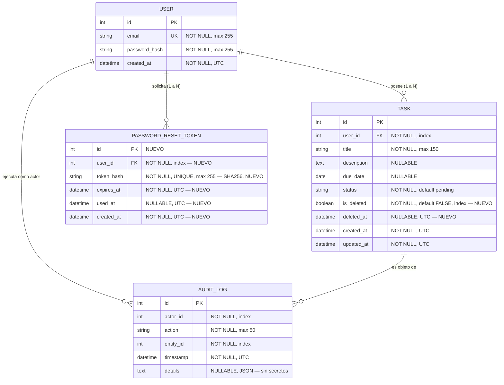
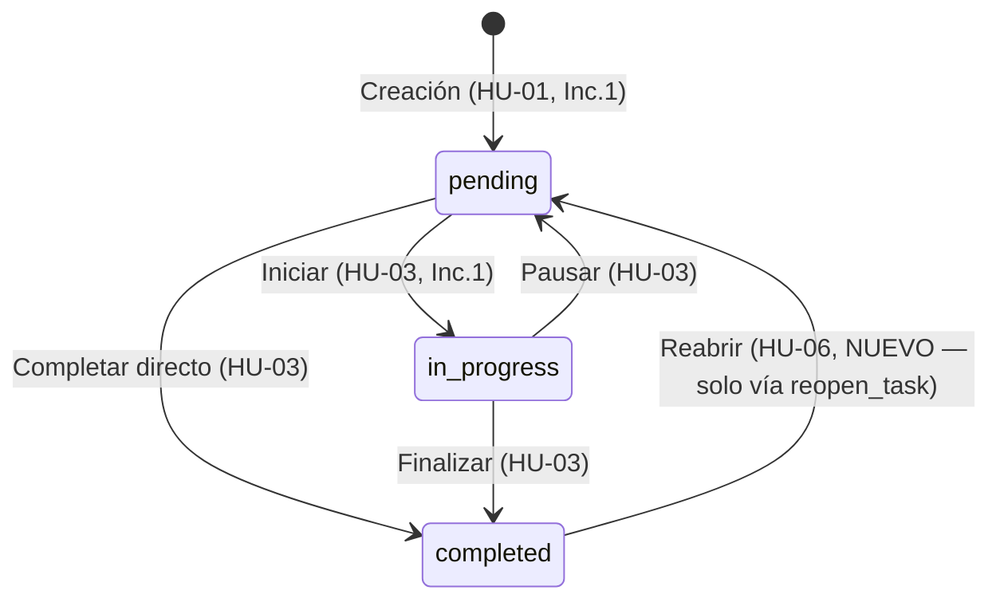

# Data Model: 002-task-lifecycle-recovery

**Feature**: 002-task-lifecycle-recovery (HU-05, HU-06, HU-14)
**Date**: 2026-10-02
**ORM**: SQLAlchemy (Flask-SQLAlchemy) — extiende `specs/001-basic-tasks-auth/data-model.md`
**Migración**: `add_soft_delete_and_reset_tokens` (aditiva, reversible)

---

## 1. Diagrama Entidad-Relación (delta sobre Incremento 1)

`User` y `AuditLog` **no cambian de esquema**; `AuditLog.action` amplía su vocabulario controlado (sin cambio DDL, es solo convención).

---

## 2. Delta de entidades

### 2.1. `Task` — extensión soft delete (HU-05)

| Campo | Tipo | Restricciones | Valor en filas preexistentes (Inc.1) |
|---|---|---|---|
| `is_deleted` | `Boolean` | NOT NULL, DEFAULT `False`, INDEX | `False` vía `SERVER_DEFAULT` (sin UPDATE manual) |
| `deleted_at` | `DateTime` | NULLABLE, UTC | `NULL` |

**Invariantes de dominio (`TaskService`)**:
- Creación siempre con `is_deleted=False, deleted_at=None`.
- `get_user_tasks(user_id, status)`: añade `WHERE is_deleted = FALSE` **antes** de cualquier filtro de `status`. HU-02 conserva firma y comportamiento visible (las eliminadas desaparecen del listado y de los conteos).
- `get_task_by_id(user_id, task_id)`: filtra `is_deleted=FALSE`; si la fila existe pero está eliminada, o pertenece a otro usuario, eleva `TaskNotFoundError` → HTTP `404` (no filtra propiedad, Principio VII).
- `delete_task(user_id, task_id)`: exige viva + propiedad; si ya `is_deleted=True` → `TaskAlreadyDeletedError` → HTTP `404` con `code=TASK_ALREADY_DELETED` (FR-004; evita doble auditoría). Marca atómica `is_deleted=True, deleted_at=now_utc` + `AuditLog(TASK_DELETED)`.
- `update_task_status` / `update_task_details`: primera guarda `if task.is_deleted: raise TaskDeletedError` → HTTP `404/400` con `code=TASK_DELETED` (FR-005).
- Prohibido `db.session.delete()` sobre `Task` en todo el código (revisión por grep en CI).

### 2.2. Máquina de estados + reapertura (HU-06)

- `VALID_TRANSITIONS` de `update_task_status` **no cambia**: `completed → {}` sigue vacío (contrato Inc.1 intacto).
- Nuevo método `TaskService.reopen_task(user_id, task_id)`: única vía legal `completed → pending`. Reglas:
  - Viva (`is_deleted=False`, si no → `TaskDeletedError`).
  - `status == 'completed'` (si no → `InvalidStateTransitionError` con mensaje "solo completadas").
  - Propiedad verificada.
  - Efecto: `status='pending'` + `AuditLog(action='TASK_REOPENED', details={previous_status:'completed', current_status:'pending'})`.
- Distinción en auditoría (Principio VIII / FR-009):

| Evento | `action` | `details` típico |
|---|---|---|
| Cambio ordinario (HU-03) | `STATUS_CHANGED` | `{previous_status, current_status}` (nunca desde `completed`) |
| Reapertura (HU-06) | `TASK_REOPENED` | `{previous_status:'completed', current_status:'pending', via:'reopen'}` |
| Eliminación (HU-05) | `TASK_DELETED` | `{status_at_delete, deleted_at}` |
| Creación (HU-01) | `TASK_CREATED` | sin cambios |

### 2.3. `PasswordResetToken` — nueva entidad (HU-14)

| Campo | Tipo | Restricciones | Descripción |
|---|---|---|---|
| `id` | `Integer` | PK autoincrement | Identificador interno |
| `user_id` | `Integer` | FK `users.id` ON DELETE CASCADE, NOT NULL, INDEX | Propietario; `User.tokens = relationship(cascade="all, delete-orphan")` |
| `token_hash` | `String(255)` | NOT NULL, UNIQUE, INDEX | `SHA-256(token_en_claro)` en hex; búsqueda por igualdad |
| `expires_at` | `DateTime` | NOT NULL, UTC | `created_at + 60 min` |
| `used_at` | `DateTime` | NULLABLE, UTC | `NULL` = vivo; marca de consumo/rotación |
| `created_at` | `DateTime` | NOT NULL, UTC, DEFAULT now | Generación |

**Reglas de dominio (`PasswordResetService`)**:
- Generación: `token = secrets.token_urlsafe(32)`; persistir solo `sha256(token)`; `expires_at = now + 60min`; invalidar previos vivos del usuario (`used_at = now` donde `used_at IS NULL AND expires_at > now`).
- Validación de confirmación: `lookup por sha256(token_recibido)` → rechazar si inexistente, `used_at IS NOT NULL`, o `expires_at <= now` → `InvalidOrExpiredTokenError`.
- Consumo atómico: en una transacción, `user.password_hash = generate_password_hash(new_password)` + `token.used_at = now` + `AuditLog(PASSWORD_RESET_COMPLETED)`; validación de `new_password` idéntica a registro (≥8 caracteres, `ValidationError` si no).
- Solicitud: `request_reset(email)` normaliza (`strip().lower()`); si existe usuario → genera token + `AuditLog(PASSWORD_RESET_REQUESTED, entity_id=user.id, details={})` + log de correo simulado; si no existe → misma respuesta visible, sin token ni auditoría con PII.
- Secretos: el claro jamás se persiste ni se audita; `details` de ambos eventos de password **siempre vacío o sin token/email**.

---

## 3. Índices y restricciones nuevas (DDL resumido)

- `tasks.is_deleted` — `BOOLEAN NOT NULL DEFAULT 0` + `CREATE INDEX ix_tasks_is_deleted`.
- `tasks.deleted_at` — `DATETIME NULL`.
- `password_reset_tokens` — tabla nueva + `FK user_id → users.id` + `INDEX(user_id)` + `UNIQUE(token_hash)`.
- Sin alteraciones a filas del Incremento 1 salvo defaults aplicados por el motor.
