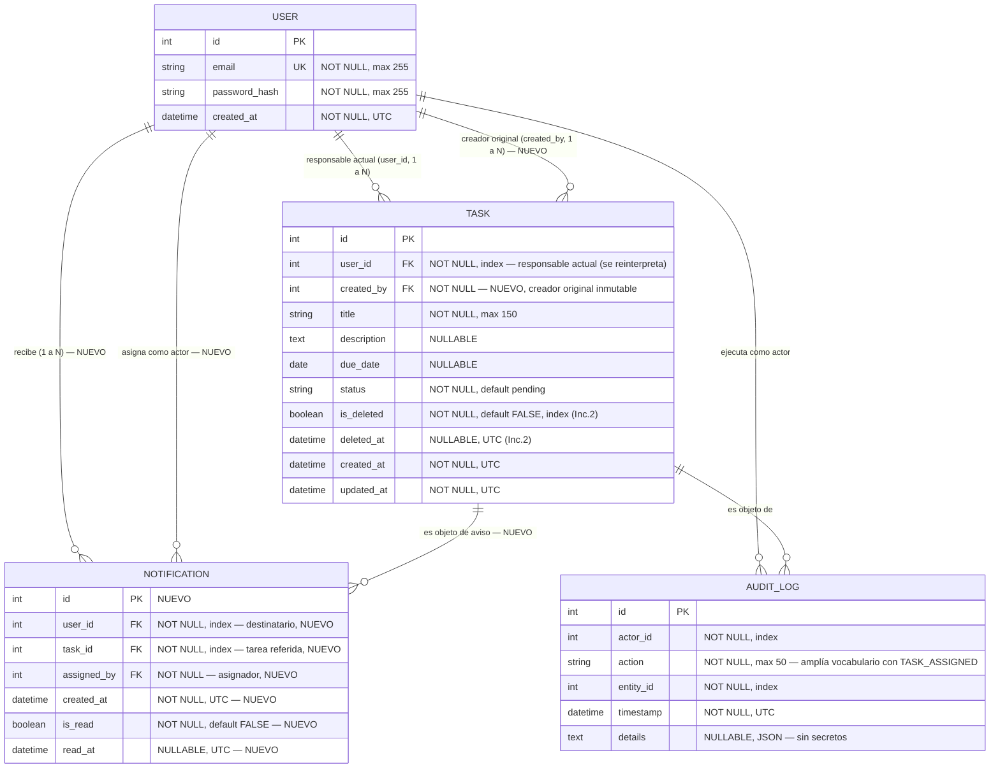
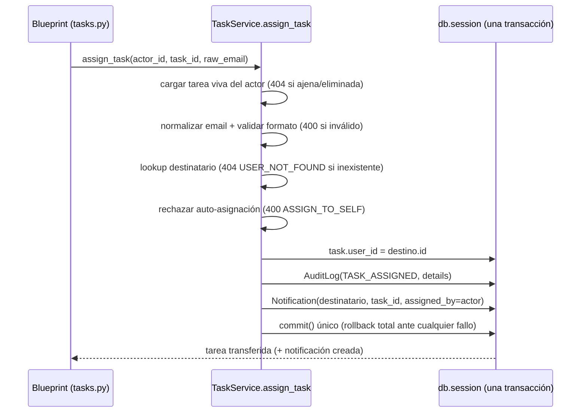

# Data Model: 003-task-assignment-notifications

**Feature**: 003-task-assignment-notifications (HU-10, HU-11)
**Date**: 2026-10-02
**ORM**: SQLAlchemy (Flask-SQLAlchemy) — extiende `specs/002-task-lifecycle-recovery/data-model.md`
**Migración**: `add_assignment_and_notifications` (aditiva, reversible)

---

## 1. Diagrama Entidad-Relación (delta sobre incrementos previos)

`User` y `AuditLog` **no cambian de esquema**; `AuditLog.action` amplía su vocabulario controlado con `TASK_ASSIGNED` (sin DDL, solo convención).

---

## 2. Delta de entidades

### 2.1. `Task` — `created_by` informativo (HU-10, decisión R-01)

| Campo | Tipo | Restricciones | Descripción |
|---|---|---|---|
| `created_by` | `Integer` | FK `users.id` (sin cascade de borrado), NOT NULL | Creador original; se fija en `create_task()` a `user_id` y **jamás muta** |

**Invariantes de dominio (`TaskService`)**:
- Creación: `user_id = created_by = autor`, `is_deleted=False`.
- Visibilidad y permisos derivan **exclusivamente** de `user_id + is_deleted=False` (todas las guardas previas — `get_task_by_id`, `update_task_status/details`, `delete_task`, `reopen_task` — operan sin cambios sobre el responsable actual).
- `created_by` no otorga visibilidad: si `created_by = A` pero `user_id = B`, solo B lista/opera la tarea.
- Derivados de presentación (solo lectura): `assigned = (created_by != user_id)`; `assigned_by_email` resuelto por join al creador/asignador registrado en la notificación o evento; filtro `origin`: `mine` ⇔ `created_by == viewer AND user_id == viewer`, `assigned` ⇔ `user_id == viewer AND created_by != viewer`, `all` ⇔ `user_id == viewer`.
- Relaciones ORM: `Task.creator = relationship(User, foreign_keys=[created_by])` coexistiendo con el `backref user` existente sobre `user_id`; `User.created_tasks` solo informativo (lazy, sin DDL adicional).

### 2.2. `Notification` — nueva entidad (HU-11, decisión R-02)

| Campo | Tipo | Restricciones | Descripción |
|---|---|---|---|
| `id` | `Integer` | PK autoincrement | Identificador interno |
| `user_id` | `Integer` | FK `users.id` ON DELETE CASCADE, NOT NULL, INDEX | Destinatario (dueño de la notificación) |
| `task_id` | `Integer` | FK `tasks.id` (sin cascade), NOT NULL, INDEX | Tarea asignada referida (sobrevive como evidencia si la tarea se elimina) |
| `assigned_by` | `Integer` | FK `users.id` (sin cascade), NOT NULL | Usuario que ejecutó la asignación (actor) |
| `created_at` | `DateTime` | NOT NULL, UTC, DEFAULT now | Momento de la asignación (misma transacción) |
| `is_read` | `Boolean` | NOT NULL, DEFAULT `False` | `False` = pendiente; `True` = leída (persiste) |
| `read_at` | `DateTime` | NULLABLE, UTC | `NULL` hasta marcarse; marca efectiva de lectura |

**Reglas de dominio (`NotificationService`)**:
- Solo el destinatario lista/marca sus notificaciones; ajenas → `NotificationNotFoundError` → `404 NOTIFICATION_NOT_FOUND` (sin distinguir existencia).
- `mark_read`: idempotente — si ya `is_read`, retorna sin mutar ni duplicar efectos.
- `mark_all_read`: actualiza en lote las pendientes del usuario; retorna `marked_count`.
- `unread_count(user_id)`: `COUNT WHERE user_id AND is_read = FALSE`.
- Sin borrado ni caducidad: ningún método elimina filas.

### 2.3. Auditoría `TASK_ASSIGNED` (Principio VIII)

| Evento | `action` | `details` típico |
|---|---|---|
| Asignación / reasignación (HU-10) | `TASK_ASSIGNED` | `{previous_owner_id, new_owner_id, assigned_to_email}` — sin secretos |

Emitido por `TaskService.assign_task()` en la misma transacción que la transferencia y la notificación, vía `AuditService.log_event(actor_id=asignador, …)`.

---

## 3. Flujo de asignación (transacción única, decisión R-04)

**Errores de dominio → HTTP** (ver `contracts/`): `TaskNotFoundError → 404 TASK_NOT_FOUND`, `TaskDeletedError → 404 TASK_NOT_FOUND`, `UserNotFoundError → 404 USER_NOT_FOUND`, `AssignToSelfError → 400 ASSIGN_TO_SELF`, `TaskValidationError → 400 VALIDATION_ERROR`. Solo los caminos exitosos mutan, auditan y notifican.

---

## 4. Índices y restricciones nuevas (DDL resumido)

- `tasks.created_by` — `INTEGER NOT NULL, FK → users.id` (+ backfill `= user_id` en la migración).
- `notifications` — tabla nueva + `FK user_id → users.id ON DELETE CASCADE` + `FK task_id → tasks.id` + `FK assigned_by → users.id` + `INDEX(user_id)` + `INDEX(task_id)` + `INDEX(user_id, is_read, created_at)`.
- Sin alteraciones a filas de incrementos previos salvo el backfill aplicado por la propia migración.
