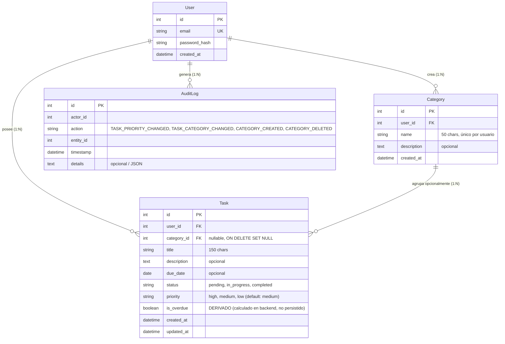

# Data Model: 003-task-organization-priority

**Feature**: 003-task-organization-priority (Organización y Priorización de Tareas)  
**Date**: 2026-10-01  
**Status**: Draft  

---

## 1. Diagrama Entidad-Relación (ERD)



---

## 2. Definición de Entidades

### 2.1 Nueva Entidad: `Category` (`categories`)

Representa una agrupación temática, carpeta o proyecto que un usuario crea para organizar sus tareas relacionadas.

| Campo | Tipo SQL | Restricciones | Descripción |
|---|---|---|---|
| `id` | `INTEGER` | Primary Key, Auto-increment | Identificador único de la categoría. |
| `user_id` | `INTEGER` | Foreign Key (`users.id` ON DELETE CASCADE), Indexed, NOT NULL | Usuario propietario de la categoría. |
| `name` | `VARCHAR(50)` | NOT NULL | Nombre de la categoría. Longitud 1 a 50 caracteres. |
| `description` | `TEXT` | Nullable | Detalle o propósito opcional de la categoría. |
| `created_at` | `DATETIME` | NOT NULL, Default UTC | Marca temporal de creación. |

**Restricciones de Tabla**:
- `UniqueConstraint("user_id", "name", name="uq_user_category_name")`: Garantiza que un usuario no pueda tener dos categorías con el mismo nombre (normalizado / case-insensitive en validación).

---

### 2.2 Entidad Modificada: `Task` (`tasks`)

Se extiende la entidad `Task` existente en el monolito para incorporar la prioridad y la pertenencia opcional a una categoría.

| Campo | Tipo SQL | Restricciones | Descripción |
|---|---|---|---|
| `id` | `INTEGER` | Primary Key, Auto-increment | Identificador de la tarea. |
| `user_id` | `INTEGER` | Foreign Key (`users.id`), NOT NULL, Indexed | Usuario propietario. |
| `category_id` | `INTEGER` | Foreign Key (`categories.id` ON DELETE SET NULL), Nullable, Indexed | **NUEVO**. Categoría a la que pertenece la tarea. Si es `NULL`, la tarea está "sin categoría". |
| `title` | `VARCHAR(150)` | NOT NULL | Título obligatorio de la tarea. |
| `description` | `TEXT` | Nullable | Descripción opcional. |
| `due_date` | `DATE` | Nullable | Fecha límite opcional. |
| `status` | `VARCHAR(20)` | NOT NULL, Default `'pending'` | Estado del ciclo de vida (`pending`, `in_progress`, `completed`). |
| `priority` | `VARCHAR(10)` | NOT NULL, Default `'medium'`, Server Default `'medium'` | **NUEVO**. Nivel de prioridad (`high`, `medium`, `low`). |
| `created_at` | `DATETIME` | NOT NULL, Default UTC | Marca de creación. |
| `updated_at` | `DATETIME` | NOT NULL, Default UTC, On Update UTC | Última modificación. |

---

## 3. Campos Derivados y Reglas de Negocio

### 3.1 Atributo Calculado: `is_overdue` (Indicador de Vencida)

- **Tipo**: Booleano (`true` / `false`).
- **Persistencia**: **NUNCA persistido en base de datos**. Es una propiedad derivada (`@property` o getter en la capa de servicios/modelo).
- **Entorno de Evaluación**: Exclusivamente en el backend (servidor) usando la fecha actual UTC (`datetime.now(timezone.utc).date()`).

**Reglas de Decisión**:
```text
SI task.status == "completed" ENTONCES
    is_overdue = false
SINO SI task.is_deleted == true (si aplica borrado lógico) ENTONCES
    is_overdue = false
SINO SI task.due_date es NULL ENTONCES
    is_overdue = false
SINO SI task.due_date < fecha_actual_utc ENTONCES
    is_overdue = true
SINO
    is_overdue = false
FIN SI
```

---

## 4. Regla No Negociable de Eliminación de Categorías

### Comportamiento ante la eliminación de una categoría:
1. **A nivel de Base de Datos**:
   - La clave foránea `tasks.category_id` cuenta con la cláusula `ON DELETE SET NULL`.
   - Cuando se ejecuta una sentencia `DELETE FROM categories WHERE id = ?`, el motor de base de datos actualiza automáticamente a `NULL` todas las referencias foráneas en `tasks`.
2. **A nivel de Servicio de Dominio (`CategoryService.delete_category`)**:
   - Para proveer defensa en profundidad (cubriendo motores SQLite con `PRAGMA foreign_keys = OFF`), el servicio ejecuta explícitamente:
     ```python
     Task.query.filter_by(category_id=category_id).update({Task.category_id: None})
     db.session.delete(category)
     db.session.commit()
     ```
   - Las tareas asociadas permanecen intactas en la base de datos con `category_id = None`.
   - **Resultado garantizado**: Cero eliminaciones en cascada.

---

## 5. Validaciones de Dominio

### Prioridad (`priority`):
- Conjunto admisible: `{"high", "medium", "low"}`.
- Si no se proporciona en la creación: se establece automáticamente en `"medium"`.
- Si se envía un valor fuera del conjunto: se rechaza con excepción `TaskValidationError("Prioridad inválida. Debe ser 'high', 'medium' o 'low'")`.

### Categoría (`Category`):
- `name`: No puede ser nulo, vacío ni contener solo espacios en blanco. Longitud máxima: 50 caracteres.
- Unicidad: No se permite crear una categoría con un nombre que ya pertenezca al mismo usuario (`user_id`). Se normaliza con `strip()` y comparación insensible a mayúsculas.
- Autorización cruzada: Al asignar `category_id` a una tarea, el servicio valida que la categoría exista y que `category.user_id == task.user_id`. En caso contrario, lanza `TaskValidationError` o `CategoryNotFoundError`.

---

## 6. Eventos de Auditoría (Principio VIII)

Se registran los siguientes eventos estructurados inmutables en `AuditLog`:

| Acción (`action`) | Disparador | `actor_id` | `entity_id` | Detalles (`details`) |
|---|---|---|---|---|
| `CATEGORY_CREATED` | Creación de categoría | ID de usuario | ID de categoría | `{"name": name}` |
| `CATEGORY_DELETED` | Eliminación de categoría | ID de usuario | ID de categoría | `{"name": name, "unlinked_tasks_count": N}` |
| `TASK_PRIORITY_CHANGED` | Modificación de prioridad | ID de usuario | ID de tarea | `{"old_priority": old, "new_priority": new}` |
| `TASK_CATEGORY_CHANGED` | Asignación/desvinculación de categoría | ID de usuario | ID de tarea | `{"old_category_id": old, "new_category_id": new}` |
